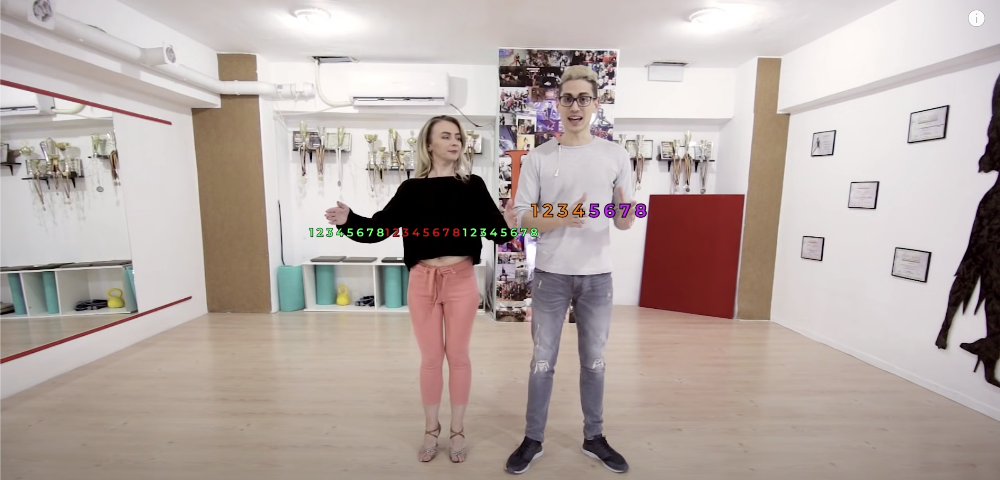

# Musicalidad en bachata sensual (y moderna)

## Ritmos de la bachata

La bachata está compuesta principalmente por 3 ritmos: derecho (también llamado "caminando"), majao y mambo. En canciones modernas, también hay un ritmo adicional donde es más instrumental (o vocal) usada en el intro de la canción, en transiciones y/o al final de la canción.

Derecho: El trinche de la güira la golpea de lado a doble tiempo (& 1 & 2 & 3 & 4 & 5 & 6 & 7 & 8) sin raspar. Este ritmo tiene la menor energía en la bachata tradicional. Deberiamos enfocarnos en pasos en posición cerrada y con poca energía. Aquí podemos enfocarnos en interpretar instrumentos diferentes a la güira y bongó como la voz.

Majao: La güira y el bongó se alinean para tocar a tiempo (1 2 3 4 5 6 7 8). Este ritmo tiene la segunda mayor energía en la bachata tradicional. Deberiamos enfocarnos en movimientos fraccionados (interpretando la güira y el bongó) a tiempo (no más de 8 movimientos seguidos) y pasos con un poco más de energía. Aquí ya podemos hacer varios pasos en posición abierta.

Mambo: Este ritmo se identificar cuando el requinto hace un solo. El cantante se calla. En canciones tradicionales, la güira y el bongó cambian su forma de tocar, pero en canciones modernas, el ritmo que mantienen el bongó y la güira es el del majao. Por ese motivo, es mejor guiarnos por el solo del requinto. Este ritmo tiene la mayor energía de todas y favorece la interpretación del requinto usando movimientos de pies. No deberiamos hacer movimientos sensuales en esta parte.

Durante la intro, es mejor enfocarse en hacer movimientos de bachata sensual que interpreten la voz o el instrumento que predomine.

Generalmente, las canciones introducen un puente para hacer la transición entre un ritmo y otro. Estas transiciones, varian bastante en su musicalidad, por lo que no hay recomendaciones de como interpretar musicalmente esas transiciones.

**Referencias:**

- [Bachata Musicality Explained: Phases](https://www.instagram.com/p/CkYkEfMo1Ol/?hl=es-la)
- [Bachata bongo rhythms (Derecho, Majao, Mambo) Tutorial](https://www.youtube.com/watch?v=ugXrFsLbkgQ&t=141s)
- [3 ritmos básicos de bachata en bongo y guira- Academia de Bachata - musicalidad](https://www.youtube.com/watch?v=kSQVKBmtZu4)

## Introducción a la teoría musical para bailarines/bailadores de bachata

Una canción de bachata está compuesta por frases musicales. Generalmente, las frases musicales están compuestas de 4 ochos (octavas). Usualmente, en la segunda mitad de la cuarta octava (o en la primera mitad de la primera octava de la siguiente frase músical) pasa algo. Por ejemplo, un repique de bongós, una variación en la güira o un golpe músical.

### Estructura general de una bachata

1. Intro: No hagas nada complicado, la idea es conocer con quien vamos a bailar entonces hacemos pasos básicos y vamos incrementando el nivel poco a poco.
2. Versos (Derecho): Es posible que en un ambiente social, tengamos que hacer la parte de conocernos en este primer verso debido a que cuando comenzamos a bailar en un social gastamos algo de tiempo en terminar la canción anterior, despedirnos e ir a bailar con otra persona.
3. Coro (Majao)
4. Footwork (Mambo): Esta parte es opcional. Hay muchos remix que no tienen mambo. En bachata tradicional, en vez de ir en el medio, puede ir distribuída en varias partes de la canción.
5. Versos (Derecho)
6. Coro (Majao)
7. Final (Outro): La energía se va abajo, entonces podríamos hacer movimiento de bachata sensual, pero pequeñitos

**Referencias:**

- [Bachata Musicality for Dancers | Bachata Musicality Workshop Breakdown | #44](https://www.youtube.com/watch?v=o4plC92SzUk)

## Interpretación musical

No he encontrado una forma estructurada y con suficiente profundidad de como aprender musicalidad en bachata. Por lo que este documento es un esfuerzo de mi parte para aprender interpretación musical.

Para estructurar este documento, decidí estudiar varios videos de parejas de baile que yo (subjetivamente) considero que son buenas en musicalidad enfocada en sociales (No en coreografías): Daniel y Tom, Ofri y Ofir, Miguel y Sunsi, etc.

Para cada video, identificaba como expectador los momentos del baile donde los bailarines claramente interpretaban musicalmente una parte de la canción que estaba sonando. Luego de identificar esos momentos, decidí generar una clasificación para saber que cosas tenían en común esos momentos y esa clasificación es la que va a quedar estructurada en este documento.

Nota: Yo uso `interpretación musical` y `musicalidad` como sinónimos.

Voy a estructurar el aprendizaje de interpretación musical usando principalmente 2 criterios: impacto y frecuencia en la que se puede aplicar los conceptos. De esta manera, doy prioridad a los movimientos que se ven bonitos y que se pueden aplicar frecuentemente en el baile social.

1. Cortes: Los cortes son las partes en la canción donde la música para de manera abrupta. Los cortes en la bachata suelen pasar en el tiempo 1 y 5.

- [Cortes en tiempo 5](./CORTES_EN_5.md)
- [Cortes en tiempo 1](./CORTES_EN_1.md)
- Cortes en tiempo 7: Son poco comunes por lo que solo voy a dar [un ejemplo](https://youtu.be/PWWwwHaRUAo?t=73)

2. [Majao](./MAJAO.md): Como expliqué anteriormente, el majao es la parte de la canción donde la güira y el bongó se alinean para tocar todos los tiempos (1 2 3 4 5 6 7 8). Estos son los instrumentos que vamos a interpretar musicalmente.

Golpes secos (Staccato): Movimientos rápidos que se acaban

Golpes extendidos (Guitarra o Voz): Movimiento extendidos

Si la voz se vuelve más aguda, el movimiento debería ir hacia arriba

Si la voz se vuelve más grave, el movimiento debería ir hacia abajo

Adaptarnos a las inflexiones de voz

Pasos para cambio de tiempo: Role rotation

Consejos:

- No intentes interpretar toda la música
- Espera 8 tiempos antes de cambiar de un instrumento a otro
- La musicalidad se practica antes de los sociales, escuchando la música y entrenando. A los sociales, se va a disfrutar y a poner en practica lo aprendido.
- Usa el tempo y energia de la música. Si la música va lento y con poca energía, haz movimientos lentos. Si la música va rápida y con mucha energía, haz movimientos rápidos.

**Referencias:**

- [Bachata Musicality for Dancers | Bachata Musicality Workshop Breakdown | #44](https://www.youtube.com/watch?v=o4plC92SzUk)
