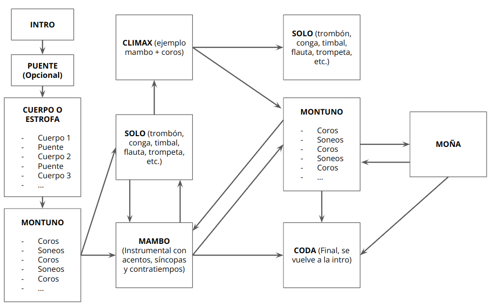

# Musicalidad en salsa (on1, on2, caleña y casino)

## Estructura básica de un tema de salsa

**Intro:** Usualmente, instrumental con melodia hecha por metales, vibrafono o por el cantante. Esta parte nos sirve para identificar el  caracter y genero del tema (guaracha, romántico, fuerte, pachanga, etc.)

**Puente (opcional):** Se usa para cambiar de sección o dividir el cuerpo del tema. Usualmente, se cambia de ritmo, dinámica y armonía. Se usan ritmos especificos: Bomba, Guaguancó, Caballo, Oriza, etc.

**Cuerpo o estrofa:** Se desarrolla la historia de la canción, Puede tener varias partes separadas por puentes.

**Montunos:** Comienzan los coros y el sonero improvisa y pregona entre coro y coro. Piano y bajo hacen tumba y guajeo estable para que el que cambie la dinámica sea el sonero. La dinamica y energía sube porque el timbalero sube a la campana (o contracampana) del timbal y el bongocero suelta el bongó y agarra la campana de bongó.

**Mambo:** Una sección instrumental (el cantante se calla) lleno de contratiempos, síncopas y acentos que podemos interpretar en el baile.

**Coda (Final)**: Vuelve a la introducción.

**Notas:**

- Un sonero aparte de cantar, tiene la habilidad de improvisar melodicamente y en clave.

- Mambo tiene diferentes significados: genero musical, baile, sección de un tema.

- ¿Qué es moña?

**Ejemplo: Palo pa' la campana - Tromboranga**
- [0:00](https://youtu.be/sv0a5-RtGcQ?t=0) - [0:20](https://youtu.be/sv0a5-RtGcQ?t=20) Intro: Trombones hacen la melodía principal. 8 octavas.

- [0:20](https://youtu.be/sv0a5-RtGcQ?t=20) - [0:32](https://youtu.be/sv0a5-RtGcQ?t=32) Puente: Ritmo Oriza de Puerto Rico. 5 octavas.

- [0:32](https://youtu.be/sv0a5-RtGcQ?t=32) - [0:52](https://youtu.be/sv0a5-RtGcQ?t=52) Cuerpo 1: El cantante empieza la historia. 8 octavas.

- [0:52](https://youtu.be/sv0a5-RtGcQ?t=52) - [1:02](https://youtu.be/sv0a5-RtGcQ?t=62) Puente: Oriza. 4 octavas.

- [1:02](https://youtu.be/sv0a5-RtGcQ?t=62) - [1:22](https://youtu.be/sv0a5-RtGcQ?t=82) Cuerpo 2: Continua la historia. 8 octavas.

- [1:22](https://youtu.be/sv0a5-RtGcQ?t=82) - [1:28](https://youtu.be/sv0a5-RtGcQ?t=88) Puente: Cha Cha Lokafun. 3 octavas.

- [1:28](https://youtu.be/sv0a5-RtGcQ?t=88) - [2:11](https://youtu.be/sv0a5-RtGcQ?t=131) Montuno: Sube la energia. 16 octavas.

-[2:11](https://youtu.be/sv0a5-RtGcQ?t=131) - [2:22](https://youtu.be/sv0a5-RtGcQ?t=142) Mambo (tutti con bajo y piano solos). 4 octavas.

- [2:22](https://youtu.be/sv0a5-RtGcQ?t=142) - [2:32](https://youtu.be/sv0a5-RtGcQ?t=152) Mambo (entra la percusión). 4 octavas.

- [2:32](https://youtu.be/sv0a5-RtGcQ?t=152) - [2:52](https://youtu.be/sv0a5-RtGcQ?t=172) Mambo (entran los trombones con melodías, síncopas y contratiempos). 8 octavas. Hay acentos (5 6+ 7~) al final de cada 4x8.

- [2:52](https://youtu.be/sv0a5-RtGcQ?t=172) - [3:01](https://youtu.be/sv0a5-RtGcQ?t=181) Puente: Guajeo en el piano. 4 octavas. Hay unos acentos de percusión en las últimas 2 octavas.

- [3:01](https://youtu.be/sv0a5-RtGcQ?t=181) - [3:31](https://youtu.be/sv0a5-RtGcQ?t=211) Solo: campana. 12 octavas.

- [3:31](https://youtu.be/sv0a5-RtGcQ?t=211) - [3:51](https://youtu.be/sv0a5-RtGcQ?t=231) Climax: mambo + coros. 8 octavas.

- [3:51](https://youtu.be/sv0a5-RtGcQ?t=231) - [4:31](https://youtu.be/sv0a5-RtGcQ?t=271) Montuno 2: el sonero improvisa y pregona entre coro y coro. 16 octavas.

- [3:51](https://youtu.be/sv0a5-RtGcQ?t=231) - [4:31](https://youtu.be/sv0a5-RtGcQ?t=271) Montuno 2: el sonero improvisa y pregona entre coro y coro. 16 octavas.

- [4:31](https://youtu.be/sv0a5-RtGcQ?t=271) - [4:51](https://youtu.be/sv0a5-RtGcQ?t=292) Final - Coda: Cruda la percusión con los coros a ritmo de oriza y el sonero improvisando. 8 octavas.

## Cambio de clave de son 2-3 y 3-2

La clave se mantiene constante sonando, pero cuando cambia el tiempo porque el arreglista así lo quiso, entonces cambia el tiempo y la clave cambia de una para otra. Cuando esto pasa, debemos buscar formas de cambiar de tiempo en el baile.

**Referencias:**
- [Cuando tus PIES y la CLAVE se VOLTEAN - Musicalidad para bailadores Joaquin Arteaga](https://youtu.be/oGtfyUWFl2A)

**Canciones para practicar:**
- Te provoca - Tromboranga([0:52](https://youtu.be/3spiqtdmviQ?t=52), [1:16](https://youtu.be/3spiqtdmviQ?t=76), [1:36](https://youtu.be/3spiqtdmviQ?t=96), [1:49](https://youtu.be/3spiqtdmviQ?t=109), [3:01](https://youtu.be/3spiqtdmviQ?t=181), [6:00](https://youtu.be/3spiqtdmviQ?t=360))

**Referencias:**

- [MUSICALIDAD para BAILADORES: Estructura básica de un tema de salsa - Joaquin Arteaga](https://youtu.be/z3hR7BHe2iY)